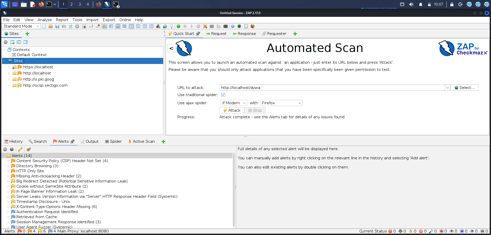

# web-vulnerability-scanner

Hands-on web vulnerability assessment using OWASP ZAP against DVWA (Damn Vulnerable Web Application) running locally on Kali Linux.

> ⚠️ **Ethical use only.** All scans were performed against DVWA — a deliberately vulnerable web application running on my local machine. No real websites were scanned.

---

## Tools Used

| Tool | Purpose |
|------|---------|
| **OWASP ZAP** | Automated web vulnerability scanner |
| **DVWA** | Deliberately vulnerable target app |
| **Kali Linux** | Security testing environment |

---

## Target

**DVWA (Damn Vulnerable Web Application)**
Running locally at `http://localhost/dvwa`
Security level set to: **Low**

---

## Scan Results

**Total alerts found: 14**

| Risk | Vulnerability | Location |
|------|--------------|----------|
| 🔴 High | SQL Injection | /dvwa/vulnerabilities/sqli/ |
| 🔴 High | Cross Site Scripting (Reflected) | /dvwa/vulnerabilities/xss_r/ |
| 🟡 Medium | Missing Anti-CSRF Token | /dvwa/login.php |
| 🟡 Medium | X-Frame-Options Header Missing | All pages |
| 🟡 Medium | Content Security Policy Missing | All pages |
| 🟢 Low | Cookie without HttpOnly Flag | Session cookie |

> See `zap_report.html` for the full detailed report.

---

## Screenshots

---

## What I Did

1. Installed and started DVWA on Kali Linux
2. Set DVWA security level to Low
3. Opened OWASP ZAP → Automated Scan
4. Entered target: `http://localhost/dvwa`
5. Clicked Attack — scan ran for ~5 minutes
6. Reviewed 14 alerts in the Alerts tab
7. Exported full HTML report

---

## What I Learned

### SQL Injection
DVWA's login and search forms pass user input directly into SQL queries
without sanitization. ZAP confirmed this by injecting `'` and `OR 1=1`
payloads and detecting database error messages in the response.

**Risk:** An attacker can bypass login, dump the entire database,
or delete data.

### XSS (Cross-Site Scripting)
The reflected XSS page echoes user input back into the page without
encoding it. ZAP confirmed by injecting ``
and detecting it in the response.

**Risk:** An attacker can steal session cookies, redirect users,
or run malicious code in victims' browsers.

### Missing Security Headers
Pages lack `X-Frame-Options` and `Content-Security-Policy` headers.

**Risk:** Without these headers the site is vulnerable to clickjacking
and other browser-based attacks.

### CSRF Token Missing
Forms don't include anti-CSRF tokens.

**Risk:** An attacker can trick a logged-in user into submitting
forms without their knowledge.

---

## Key Takeaways

- Every web form is a potential attack surface
- SQL injection and XSS are still the most common high-risk vulnerabilities
- Missing security headers are easy to fix but often overlooked
- Automated scanners like ZAP find obvious issues fast — but manual testing
  is needed to confirm and find deeper vulnerabilities

---

## Environment

- OS: Kali Linux (VirtualBox)
- Tool: OWASP ZAP
- Target: DVWA (local)
- Date: 2025

---

## Disclaimer

All testing was performed against a deliberately vulnerable application
running on my own local machine. No real websites were scanned.

---

## License

MIT
